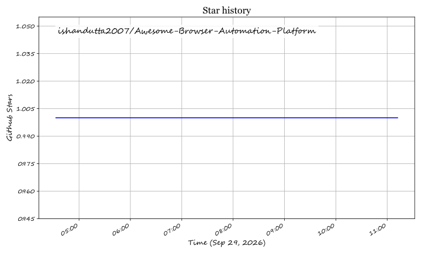

# Awesome Browser Automation Platform Ecosystem 🌐

  
  
  
  
  
  

> **A curated, high-impact directory of SaaS products and open-source projects for Browser Automation, Cloud Browser Infrastructure, AI Agent Execution, Web Scraping, and Anti-Detection Stealth.**

---

## 💡 Overview & Executive Summary

Modern AI agents and software systems require scalable, resilient, and anti-detect browser infrastructure to perform web tasks programmatically—such as autonomous scraping, automated form filling, session management, and UI testing.

### 📊 Market Size & Sector Fragmentation
- **Market Size:** The global browser automation, web scraping, and anti-detect infrastructure market is estimated at **~$3.8 Billion USD in 2026** and projected to exceed **$9.2 Billion USD by 2032** (CAGR ~15.8%), heavily accelerated by the rapid surge in LLM web-browsing agents and autonomous AI workflows.
- **Market Dynamics:** The sector is **moderately fragmented**, experiencing a dynamic split between developer-centric cloud browser APIs (e.g., Browserbase, Steel.dev) and specialized stealth anti-detect profile managers (e.g., Multilogin, GoLogin, AdsPower). While network effects and cloud scale favor emerging market leaders, open-source frameworks continue to maintain strong developer adoption for self-hosted execution.

---

## 📌 Table of Contents

- [☁️ SaaS & Hosted Platforms](#️-saas--hosted-platforms)
- [🔓 Open-Source GitHub Repositories](#-open-source-github-repositories)
- [🛠️ Architecture & Integration Patterns](#️-architecture--integration-patterns)
- [🤝 How to Contribute](#-how-to-contribute)
- [💖 Support & Sponsorship](#-support--sponsorship)
- [📈 Star History](#-star-history)
- [⚠️ Disclaimer](#️-disclaimer)

---

## ☁️ SaaS & Hosted Platforms

The table below lists top commercial SaaS platforms providing cloud browser infrastructure, API endpoints, or stealth anti-detect browser profile managers.

> **Sorted by Financial Scale / Valuation (Descending)**

| Platform 🚀 | Scale / Revenue / Valuation 💰 | Starting Price 💵 | Free Tier / Trial Limit 🎁 | Description & Core Focus 🔍 |
| :--- | :--- | :--- | :--- | :--- |
| **[Browserbase](https://www.browserbase.com/)** | **$300M Valuation** (Series B, 2025; >$3M ARR) | $20/month (Developer Tier) | Free Forever: 1 browser hr/mo, 3 concurrent sessions, 3 agent runs/mo | Cloud browser infrastructure designed for AI agents with headless sessions, proxy rotation, session replay, and stealth. |
| **[Steel.dev](https://steel.dev/)** | **~$17M Raised** (~$3.5M ARR) | $250/month (Scale Plan) | Launch Plan: Free to start with $30 one-time usage credits | Open-source browser API for AI agents and apps. Manages browser sessions, anti-detection, and page-to-markdown/PDF conversion. |
| **[Multilogin](https://multilogin.com/)** | **€8.2M Revenue** (~$9.0M ARR, 2022 filing) | $7.08/month (Billed annually) | Free Forever: Up to 5 browser/cloud phone profiles, 200 MB proxy data | Anti-detect browser platform for managing isolated profiles with unique fingerprints and residential proxies. |
| **[GoLogin](https://gologin.com/)** | **~$2.7M ARR** (Est. 27+ team members) | $9.00/month (Billed annually) | Free Forever: 3 profile limit + 7-day full feature trial | Anti-detect browser with cloud profile synchronization, team collaboration, and automated proxy management. |
| **[AdsPower](https://www.adspower.com/)** | **~$1.7M ARR** (Est. 15+ team members) | $5.40/month (Billed annually) | Free Forever: 2 profile limit + 7-day free trial for paid features | Anti-detect browser featuring profile isolation, multi-account management, and official CLI (`adspower-browser`) for AI agents. |
| **[Browserless](https://www.browserless.io/)** | **~$1.3M ARR** (Bootstrapped enterprise) | $25.00/month (Prototyping Plan) | Free Forever: 1,000 execution units/month | Headless Chrome/Chromium cloud service for automated screenshot generation, PDF creation, and high-concurrency scraping. |
| **[Kameleo](https://kameleo.io/)** | **Private / VC Bootstrapped** | €29.00/month (~$32/mo Base Plan) | No free trial available (Paid plans only) | Anti-detect browser providing engine-level fingerprint masking for Chromium and Firefox, Docker-ready with multi-language SDKs. |
| **[Octo Browser](https://octobrowser.net/)** | **Private / Undisclosed** | €21.00/month (~$23/mo Starter Tier) | No free trial; no standing free plan | Anti-detect browser engineered for multi-accounting, fingerprint management, and automated web interaction. |
| **[BrowserCat](https://www.browsercat.com/)** | **Private / Developer Infrastructure** | $50.00/month (Business Plan) | Free Forever (Hobby Plan): 1,000 credits/month | Cloud browser API equipped with an MCP (Model Context Protocol) server for seamless LLM and AI agent integration. |

---

## 🔓 Open-Source GitHub Repositories

Top open-source projects for self-hosting browser infrastructure, anti-detect automation, and AI agent web navigation frameworks.

> **Sorted by GitHub_Stars (Descending)**

| Repository 📦 | GitHub_Stars ⭐ | Primary License 📜 | Description & Technical Highlights 💡 |
| :--- | :--- | :--- | :--- |
| **[Browser Use](https://github.com/browser-use/browser-use)** |  | MIT | Autonomous AI agent web automation framework. Controls real browsers via LLMs, with CLI, Cursor, and Python integration. |
| **[Puppeteer](https://github.com/puppeteer/puppeteer)** |  | Apache-2.0 | Node.js library providing a high-level API over the Chrome DevTools Protocol (CDP) for headless browser control. |
| **[Playwright](https://github.com/microsoft/playwright)** |  | Apache-2.0 | Node.js/Python/Java/C# library for reliable end-to-end testing and browser automation across Chromium, Firefox, and WebKit. |
| **[Crawlee](https://github.com/apify/crawlee)** |  | Apache-2.0 | Scalable web crawling and scraping library for Node.js with built-in proxy management, headless browser control, and storage. |
| **[Stagehand](https://github.com/browserbase/stagehand)** |  | MIT | AI-native browser automation framework built on Playwright. Uses natural language intent and self-healing selectors for LLMs. |
| **[Skyvern](https://github.com/Skyvern-AI/skyvern)** |  | AGPL-3.0 | Vision-based browser automation driven by computer vision and LLMs to navigate complex UIs without DOM selectors. |
| **[Nanobrowser](https://github.com/nanobrowser/nanobrowser)** |  | Apache-2.0 | Open-source Chrome extension enabling multi-agent local web automation with private LLM keys. |
| **[Steel Browser](https://github.com/nickzahn/steel-browser)** |  | Apache-2.0 | Open-source browser sandbox API for AI agents. Features session isolation, CDP control, anti-detection, and markdown rendering. |
| **[Browserless (Driver)](https://github.com/browserless/chrome)** |  | SSPL-1.0 | Open-source headless Chrome driver image designed for scalable Docker deployment and REST/WebSocket automation APIs. |
| **[Persona Studio](https://github.com/TechQaiser/persona-studio)** |  | MIT | Self-hosted anti-detect browser and profile manager with coherent fingerprints, proxy binding, and React dashboard. |
| **[veilbrowser](https://github.com/acunningham-ship-it/veilbrowser)** |  | MIT | Stealth Python browser driving unmodified Chrome binaries over raw CDP with hardware fingerprint noise injection. |
| **[gox-browser](https://github.com/chinayin/gox-browser)** |  | MIT | High-performance Go headless browser pool featuring WAF evasion (Cloudflare/Akamai), rate limiting, and Rod/Surf drivers. |
| **[Kameleo SDK](https://github.com/kameleo-io/kameleo)** |  | MIT | Open-source client SDK for connecting Playwright, Puppeteer, and Selenium to Kameleo anti-detect browser profiles. |
| **[Fury Anti-Detect](https://github.com/furyteamtop/fury-antidetect-browser)** |  | GPL-3.0 | Free anti-detect Chromium fork implementing C++ level fingerprint masking, WebRTC protection, and offline GeoIP. |
| **[mcp-tool-shop-org/brand](https://github.com/mcp-tool-shop-org/brand)** |  | MIT | Centralized repository for organization brand assets, logos, and ecosystem badges. |

---

## 🛠️ Architecture & Integration Patterns

When implementing browser automation for enterprise applications or autonomous AI agents, choose the framework combination that fits your operational scale:

1. **AI-Native Intent Automation:** Pair **Stagehand** or **Browser Use** with **Browserbase** or **Steel.dev** for cloud session management with semantic element targeting.
2. **Vision-Driven Web Operations:** Utilize **Skyvern** for legacy websites, visual canvas elements, or complex UIs lacking reliable DOM selectors.
3. **Self-Hosted Anti-Detect Infrastructure:** Deploy **Persona Studio**, **gox-browser**, or **Fury** for self-managed browser profile isolation and proxy rotation.

---

## 🤝 How to Contribute

Contributions to expand or update this ecosystem directory are always welcome!

1. 🍴 **Fork** the repository.
2. 📝 **Edit `README.md`** following the existing Markdown format and table structures.
3. 🔎 Ensure all added entries specify: project name, official URL / repository, pricing or license details, and factual descriptions.
4. 🚀 **Submit a Pull Request** with a brief summary of your updates.

---

## 💖 Support & Sponsorship

Thank you for exploring and using this repository! If this curated platform directory has helped your projects, workflow, or AI agent development, please consider showing your support:

- ⭐ **Star** this repository on GitHub to help increase its visibility!
- 🍴 **Fork** and share it with fellow developers, engineers, and researchers.
- ☕ **Sponsor & Buy Me a Coffee:** Support ongoing maintenance, research, and open-source updates via the [GitHub Sponsors Dashboard](https://github.com/sponsors/ishandutta2007).

---

## 📈 Star History

---

## ⚠️ Disclaimer

- This list is **community-curated** for informational and research purposes.
- All browser automation tools must be operated in full compliance with applicable local laws, target site Terms of Service, and ethical web crawling practices.
- Anti-detect platforms are intended for multi-account testing, privacy verification, and browser fingerprint research.

---

  <b>Built with ❤️ for AI Engineers, Automation Developers, QA Specialists, and Web Researchers.</b>

## Star History

<a href="https://star-history.com/#ishandutta2007/Awesome-Browser-Automation-Platform&Timeline" align="center">
  <picture>
    <source media="(prefers-color-scheme: dark)" srcset="assets/ishandutta2007_Awesome-Browser-Automation-Platform_growth.svg">
    
  </picture>
</a>
